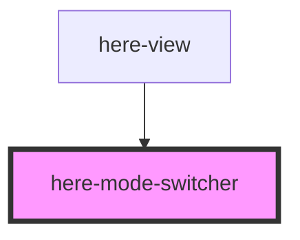

# here-mode-switcher

<!-- Auto Generated Below -->

## Properties

| Property     | Attribute     | Description           | Type                                              | Default    |
| ------------ | ------------- | --------------------- | ------------------------------------------------- | ---------- |
| `activeMode` | `active-mode` | Currently active mode | `"day" \| "deep-time" \| "phenology" \| "strata"` | `'strata'` |

## Events

| Event        | Description                              | Type                                                           |
| ------------ | ---------------------------------------- | -------------------------------------------------------------- |
| `modeChange` | Fired when user selects a different mode | `CustomEvent<"day" \| "deep-time" \| "phenology" \| "strata">` |

## Dependencies

### Used by

 - [here-view](../here-view)

### Graph

----------------------------------------------

*Built with [StencilJS](https://stenciljs.com/)*
