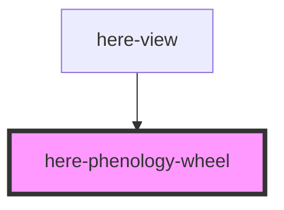

# here-phenology-wheel

<!-- Auto Generated Below -->

## Properties

| Property      | Attribute      | Description                         | Type       | Default |
| ------------- | -------------- | ----------------------------------- | ---------- | ------- |
| `currentWeek` | `current-week` | Current week of year (1-52)         | `number`   | `1`     |
| `entities`    | --             | Entities with phenology information | `Entity[]` | `[]`    |

## Dependencies

### Used by

 - [here-view](../here-view)

### Graph

----------------------------------------------

*Built with [StencilJS](https://stenciljs.com/)*
