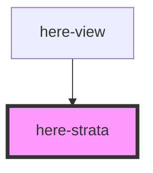

# here-strata

<!-- Auto Generated Below -->

## Properties

| Property | Attribute | Description                                   | Type            | Default |
| -------- | --------- | --------------------------------------------- | --------------- | ------- |
| `layers` | --        | Ordered list of strata layers (sky → bedrock) | `StrataLayer[]` | `[]`    |

## Dependencies

### Used by

 - [here-view](../here-view)

### Graph

----------------------------------------------

*Built with [StencilJS](https://stenciljs.com/)*
